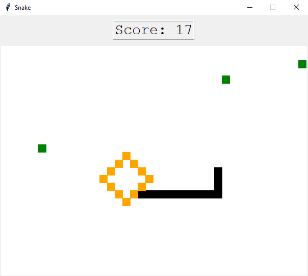

  
  <h1 align="center" style="border-bottom: none"><b>Introduction to Computer Science - Exercise 10 - Snake Game</b></h1>

  

    <b>Snake</b> is the 10th exercise I've solved in Huji's <b>Introduction to Computer Science</b> course.
     
    The main idea behind this exercise is to get familiar with <b>OOP</b>, <b>Team Work</b>, and <b>GIT</b>.
     
  

 

  <h2 align="left" style="border-bottom: 1px solid gray">Usage</h2>

  
Run the project on your personal machine:

  <ol align="left">
    <li>Clone this repository using <code>git clone &lt;url&gt;</code></li>
    <li>Open the cloned project in your IDE</li>
    <li><i>(Optional)</i> Create a virtual environment using <code>python3 -m venv venv</code></li>
    <li>Use <code>pip install -r requirements.txt</code> to install all required libraries</li>
    <li>Run <code>python3 &lt;python file&gt;</code> to run the project</li>
    <li>Alternatively, you can download the executable file and play the game directly</li>
  </ol>

 

  <h2 align="left" style="border-bottom: 1px solid gray">Media</h2>

  

    
  

 

  <h2 align="left" style="border-bottom: 1px solid gray">Contributing</h2>

  

    Pull requests are welcome. For major changes, please open an issue first to discuss what you would like to change.
  

